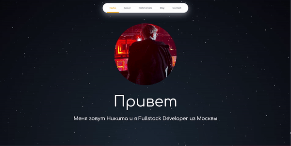

# Сайт портфолио by atikij

Ознакомиться: [https://atikij.github.io/portfolio/](https://atikij.github.io/portfolio/)


## Описание

Это портфолио сайт, созданный с использованием Vite и Vue.js. Он предоставляет информацию о моих проектах, навыках и достижениях.

## Процесс разработки

Этот проект находится в процессе разработки. Вот текущие задачи и планы:

### Задачи

- [x] Инициализация проекта
- [x] Создание структуры сайта
- [x] Разработка основных страниц
- [ ] Оптимизация производительности
- [ ] Доработка адаптивности
- [ ] Тестирование и отладка
- [ ] Добавление анимаций и улучшение UX

### Планы

- Улучшить навигацию по сайту
- Добавить блог для публикации технических статей

## Установка и использование

Для локального запуска сайта выполните следующие шаги:

1. **Клонирование репозитория:**
   ```sh
   git clone https://github.com/atikij/portfolio.git
   cd portfolio
2. **Установите зависимости:**
   ```sh
   npm install
4. **Запустите проект:**
   ```sh
   npm run dev
